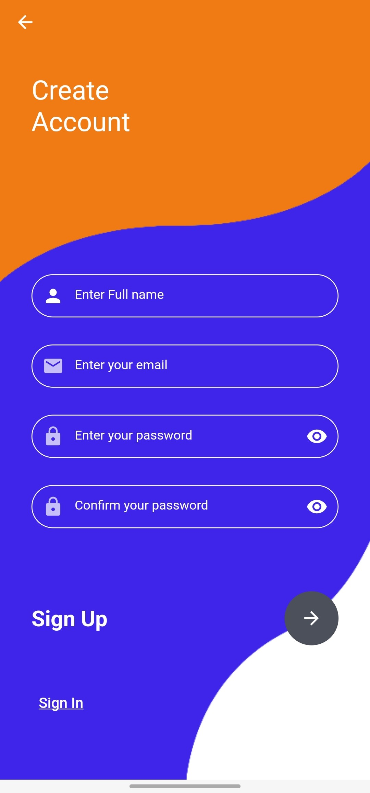
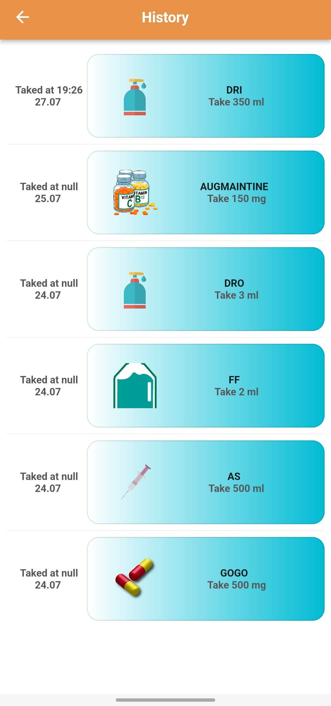

# MedTrack - Flutter Application

The Medicines App is a user-friendly Flutter application designed to help you manage your medications efficiently. With this app, you can save your medicines and receive timely reminders to take them, ensuring you never miss a dose. The app offers several useful features to streamline your medication management process.

## Getting Started

To get started with the Medicines App, you can refer to the online documentation provided by Flutter. The documentation contains tutorials, samples, and comprehensive guidance on mobile development, along with a full API reference. Visit [Flutter Documentation](https://flutter.dev/docs) for detailed instructions.

## App Features

The Medicines App boasts the following features:

### Save Medicines

Easily save your medicines in the app's local database. You can input details such as medicine name, dosage, and frequency.

### Daily Medicines Display

The app conveniently displays all your scheduled medicines for each day, making it simple to keep track of your daily medication routine.

### Timely Reminders

Never miss a dose again! The Medicines App sends you notifications at the correct time to remind you to take your medicines.

### Delete Medicines

If you no longer need a particular medicine or have finished a course, you can effortlessly delete it from the app.

### Medicines History

The app maintains a history of taken medicines, allowing you to review your medication adherence and track your progress over time.

### Statistics and Analytics

Get insights into your medication habits with comprehensive statistics and analytics. The app provides visual representations of your medication adherence and usage patterns.

### Quick SOS Button

In case of emergencies, the app includes a quick SOS button that provides instant access to critical information or emergency contacts.

The Medicines App aims to be your reliable partner in managing your medications, ensuring you stay on track with your treatment plans and maintain your well-being.

### Screenshots :

